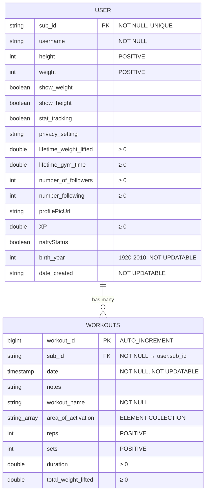

# MuscleHead Database Schema Visualization

## Entity Relationship Diagram (Mermaid)



## Entity Relationship Diagram (ASCII)

```
┌─────────────────────────────────────────────────────────────┐
│                         USER                                 │
├─────────────────────────────────────────────────────────────┤
│ PK  sub_id                    VARCHAR (NOT NULL, UNIQUE)     │
│     username                  VARCHAR (NOT NULL)              │
│     height                    INT (POSITIVE)                 │
│     weight                    INT (POSITIVE)                 │
│     show_weight               BOOLEAN                         │
│     show_height               BOOLEAN                         │
│     stat_tracking             BOOLEAN                         │
│     privacy_setting           VARCHAR                         │
│     lifetime_weight_lifted    DOUBLE (≥ 0)                   │
│     lifetime_gym_time         DOUBLE (≥ 0)                   │
│     number_of_followers       INT (≥ 0)                      │
│     number_following          INT (≥ 0)                      │
│     profilePicUrl             VARCHAR                         │
│     XP                        DOUBLE (≥ 0)                   │
│     nattyStatus               BOOLEAN                         │
│     birth_year                INT (1920-2010, NOT UPDATABLE) │
│     date_created              VARCHAR (NOT UPDATABLE)         │
└─────────────────────────────────────────────────────────────┘
                              │
                              │ 1
                              │
                              │
                              │ *
                              ▼
┌─────────────────────────────────────────────────────────────┐
│                      WORKOUTS                                │
├─────────────────────────────────────────────────────────────┤
│ PK  workout_id               BIGINT (AUTO_INCREMENT)         │
│ FK  sub_id                   VARCHAR (NOT NULL)              │
│     date                     TIMESTAMP (NOT NULL, NOT UPDATABLE)│
│     notes                    VARCHAR                         │
│     workout_name             VARCHAR (NOT NULL)              │
│     area_of_activation       VARCHAR[] (ELEMENT COLLECTION)  │
│     reps                     INT (POSITIVE)                  │
│     sets                     INT (POSITIVE)                  │
│     duration                 DOUBLE (≥ 0)                    │
│     total_weight_lifted      DOUBLE (≥ 0)                    │
└─────────────────────────────────────────────────────────────┘
```

## Relationship Details

- **User** (1) ────< (Many) **Workout**
  - One User can have many Workouts
  - Each Workout belongs to exactly one User
  - Foreign Key: `workouts.sub_id` → `user.sub_id`
  - Relationship Type: `@OneToMany` (User side) / `@ManyToOne` (Workout side)
  - Fetch Type: LAZY (Workout → User)

### Important Note on Relationship Mapping

- The `workouts` field in the `User` entity (line 70 in User.java) is a **virtual/relationship field**
- It does **NOT** create a database column in the `user` table
- It's mapped with `@OneToMany(mappedBy = "user")` which means it's the inverse side of the relationship
- The actual relationship is stored via the `sub_id` foreign key in the `workouts` table
- This field allows Java code to navigate from a User to their Workouts: `user.getWorkouts()`
- It's marked with `@JsonIgnore` to prevent circular reference issues during JSON serialization

---

## Table: `user`

| Column Name            | Data Type | Constraints                   | Description                             |
| ---------------------- | --------- | ----------------------------- | --------------------------------------- |
| **sub_id**             | VARCHAR   | PRIMARY KEY, NOT NULL, UNIQUE | User identifier (from authentication)   |
| username               | VARCHAR   | NOT NULL                      | User's display name                     |
| height                 | INT       | POSITIVE                      | User's height                           |
| weight                 | INT       | POSITIVE                      | User's weight                           |
| show_weight            | BOOLEAN   |                               | Privacy setting for weight visibility   |
| show_height            | BOOLEAN   |                               | Privacy setting for height visibility   |
| stat_tracking          | BOOLEAN   |                               | Whether user has stat tracking enabled  |
| privacy_setting        | VARCHAR   |                               | General privacy preference              |
| lifetime_weight_lifted | DOUBLE    | ≥ 0                           | Total weight lifted across all workouts |
| lifetime_gym_time      | DOUBLE    | ≥ 0                           | Total time spent in gym (hours/minutes) |
| number_of_followers    | INT       | ≥ 0                           | Count of users following this user      |
| number_following       | INT       | ≥ 0                           | Count of users this user follows        |
| profilePicUrl          | VARCHAR   |                               | URL to user's profile picture           |
| XP                     | DOUBLE    | ≥ 0                           | Experience points earned                |
| nattyStatus            | BOOLEAN   |                               | Natural/not natural status              |
| birth_year             | INT       | 1920-2010, NOT UPDATABLE      | Year of birth                           |
| date_created           | VARCHAR   | NOT UPDATABLE                 | Account creation date                   |

**Indexes:**

- Primary Key: `sub_id`

**Relationship Fields (Not Database Columns):**

- `workouts` - List<Workout> - Virtual field for accessing user's workouts via JPA (@OneToMany, mappedBy="user", @JsonIgnore)

---

## Table: `workouts`

| Column Name         | Data Type | Constraints                 | Description                         |
| ------------------- | --------- | --------------------------- | ----------------------------------- |
| **workout_id**      | BIGINT    | PRIMARY KEY, AUTO_INCREMENT | Unique workout identifier           |
| **sub_id**          | VARCHAR   | FOREIGN KEY, NOT NULL       | References `user.sub_id`            |
| date                | TIMESTAMP | NOT NULL, NOT UPDATABLE     | When the workout occurred           |
| notes               | VARCHAR   |                             | Optional workout notes              |
| workout_name        | VARCHAR   | NOT NULL                    | Name of the workout                 |
| area_of_activation  | VARCHAR[] | ELEMENT COLLECTION          | List of muscle groups targeted      |
| reps                | INT       | POSITIVE                    | Number of repetitions               |
| sets                | INT       | POSITIVE                    | Number of sets                      |
| duration            | DOUBLE    | ≥ 0                         | Workout duration (time units)       |
| total_weight_lifted | DOUBLE    | ≥ 0                         | Total weight lifted in this workout |

**Indexes:**

- Primary Key: `workout_id`
- Foreign Key: `sub_id` → `user.sub_id`

**Relationship Fields (Not Database Columns):**

- `user` - User entity reference - Mapped via @ManyToOne to establish relationship (@JoinColumn on sub_id)

**Additional Tables (Auto-generated by JPA):**

- `workout_area_of_activation` - Join table for `area_of_activation` element collection
  - Columns: `workout_workout_id` (FK to workouts.workout_id), `area_of_activation` (VARCHAR)

---

## Validation Rules Summary

### User Entity

- `sub_id`: Cannot be blank
- `username`: Cannot be blank
- `height`: Must be positive
- `weight`: Must be positive
- `lifetime_weight_lifted`: Must be ≥ 0
- `lifetime_gym_time`: Must be ≥ 0
- `number_of_followers`: Must be ≥ 0
- `number_following`: Must be ≥ 0
- `XP`: Must be ≥ 0
- `birth_year`: Must be between 1920 and 2010 (inclusive), cannot be updated after creation
- `date_created`: Cannot be updated after creation

### Workout Entity

- `user`: Required (NOT NULL)
- `date`: Required (NOT NULL), cannot be updated after creation
- `workout_name`: Cannot be blank
- `reps`: Must be positive
- `sets`: Must be positive
- `duration`: Must be ≥ 0
- `total_weight_lifted`: Must be ≥ 0

---

## Database Configuration

- **Database Type:** PostgreSQL (Supabase)
- **JPA DDL Mode:** `update` (auto-creates/updates schema)
- **Dialect:** PostgreSQL
- **Connection:** Supabase hosted database

---

## Notes

1. **Relationship Fields vs Database Columns:**

   - The `workouts` field in `User.java` (line 70) is **NOT a database column**
   - The `user` field in `Workout.java` is **NOT a database column**
   - These are JPA relationship mappings that allow navigation between entities in Java code
   - The actual database relationship is stored via the `sub_id` foreign key in the `workouts` table

2. **Database Tables:**

   - `user` - Main user table (uses default JPA entity name)
   - `workouts` - Main workouts table (explicitly named via `@Table(name = "workouts")`)
   - `workout_area_of_activation` - Auto-generated join table for the `area_of_activation` element collection

3. **Relationship Configuration:**

   - The relationship is bidirectional: User ↔ Workouts
   - `@OneToMany(mappedBy = "user")` on User side (inverse/non-owning side)
   - `@ManyToOne` with `@JoinColumn` on Workout side (owning side)
   - `workouts` collection marked with `@JsonIgnore` to prevent circular reference during JSON serialization
   - Workout → User fetch is LAZY for performance optimization

4. **Code Generation:**
   - Both entities now use Lombok's `@Data` annotation
   - This auto-generates getters, setters, toString(), equals(), and hashCode()
   - Reduced User.java from 309 lines to 72 lines (77% reduction!)
   - Reduced Workout.java from 141 lines to 63 lines (55% reduction!)
