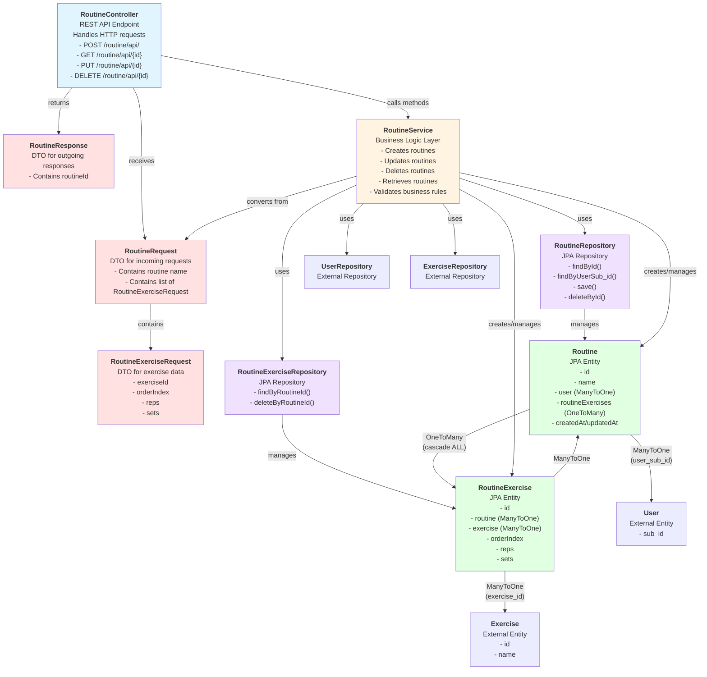

# Routine Module Architecture Diagram

This document provides a visual representation of how all Routine-related files interact with each other.

## Component Interaction Diagram

## Data Flow Explanation

### 1. **Request Flow (Incoming)**
   - HTTP request arrives at **RoutineController**
   - Controller receives **RoutineRequest** DTO containing routine name and list of **RoutineExerciseRequest** objects
   - Controller authenticates user and extracts user information

### 2. **Business Logic Processing**
   - **RoutineController** passes request to **RoutineService**
   - **RoutineService** validates business rules:
     - Ensures user exists (via **UserRepository**)
     - Validates routine name is not blank
     - Validates exercises list is not empty
     - Verifies each exercise exists (via **ExerciseRepository**)

### 3. **Entity Creation**
   - **RoutineService** creates **Routine** entity and sets user relationship
   - For each **RoutineExerciseRequest**, **RoutineService**:
     - Fetches **Exercise** entity via **ExerciseRepository**
     - Creates **RoutineExercise** entity
     - Links **RoutineExercise** to both **Routine** and **Exercise**
   - Sets up the bidirectional relationship between **Routine** and **RoutineExercise**

### 4. **Persistence**
   - **RoutineService** saves **Routine** via **RoutineRepository**
   - Due to JPA cascade (CascadeType.ALL), **RoutineExercise** entities are automatically persisted
   - **RoutineExerciseRepository** is available for direct operations if needed

### 5. **Response Flow (Outgoing)**
   - **RoutineService** returns the saved **Routine** entity
   - **RoutineController** converts it to **RoutineResponse** DTO (containing routineId)
   - Controller returns HTTP response

## File Descriptions

### **RoutineController**
- **Purpose**: REST API endpoint handler
- **Responsibilities**: 
  - Receives HTTP requests (POST, GET, PUT, DELETE)
  - Handles authentication via SecurityUtils
  - Delegates business logic to RoutineService
  - Converts between DTOs and entities
  - Returns appropriate HTTP responses
- **Key Methods**: createRoutine(), getRoutineById(), getRoutines(), updateRoutine(), deleteRoutine()

### **RoutineService**
- **Purpose**: Business logic layer
- **Responsibilities**:
  - Validates business rules
  - Creates, updates, and deletes routines
  - Manages relationships between Routine, RoutineExercise, User, and Exercise
  - Handles transactions
- **Key Methods**: createRoutine(), updateRoutine(), deleteRoutine(), getRoutineById(), getRoutinesByUserSubId()

### **RoutineRepository**
- **Purpose**: Data access layer for Routine entity
- **Responsibilities**:
  - Provides CRUD operations for Routine
  - Custom queries to find routines by user sub_id
- **Key Methods**: findById(), findByUserSub_id(), save(), deleteById()

### **RoutineExerciseRepository**
- **Purpose**: Data access layer for RoutineExercise entity
- **Responsibilities**:
  - Provides CRUD operations for RoutineExercise
  - Custom queries to find/delete exercises by routineId
- **Key Methods**: findByRoutineId(), deleteByRoutineId()

### **Routine**
- **Purpose**: Main domain entity representing a workout routine
- **Attributes**:
  - `id`: Primary key
  - `name`: Routine name
  - `user`: Owner of the routine (ManyToOne with User)
  - `routineExercises`: List of exercises in the routine (OneToMany with RoutineExercise)
  - `createdAt`, `updatedAt`: Timestamps
- **Relationships**:
  - **ManyToOne** with User (via user_sub_id foreign key)
  - **OneToMany** with RoutineExercise (cascades ALL operations)

### **RoutineExercise**
- **Purpose**: Join entity linking Routine to Exercise with specific workout parameters
- **Attributes**:
  - `id`: Primary key
  - `routine`: Parent routine (ManyToOne with Routine)
  - `exercise`: The exercise (ManyToOne with Exercise)
  - `orderIndex`: Position in routine
  - `reps`: Target repetitions
  - `sets`: Target sets
- **Relationships**:
  - **ManyToOne** with Routine (via routine_id foreign key)
  - **ManyToOne** with Exercise (via exercise_id foreign key)

### **RoutineRequest**
- **Purpose**: DTO for incoming routine creation/update requests
- **Attributes**:
  - `name`: Routine name (validated as @NotBlank)
  - `exercises`: List of RoutineExerciseRequest (validated as @NotEmpty)

### **RoutineExerciseRequest**
- **Purpose**: DTO for exercise data within routine requests
- **Attributes**:
  - `exerciseId`: ID of the exercise (validated as @NotNull)
  - `orderIndex`: Position in routine (validated as @PositiveOrZero)
  - `reps`: Target repetitions (validated as @Positive)
  - `sets`: Target sets (validated as @Positive)

### **RoutineResponse**
- **Purpose**: DTO for outgoing routine creation responses
- **Attributes**:
  - `routineId`: ID of the created routine

## Key Relationships Summary

1. **Controller → Service**: RoutineController delegates all business logic to RoutineService
2. **Service → Repositories**: RoutineService uses all repositories to access data
3. **Routine → RoutineExercise**: One-to-Many with cascade ALL (when Routine is deleted, RoutineExercises are deleted)
4. **RoutineExercise → Routine**: Many-to-One (many exercises belong to one routine)
5. **Routine → User**: Many-to-One (many routines belong to one user)
6. **RoutineExercise → Exercise**: Many-to-One (many routine exercises reference one exercise entity)
